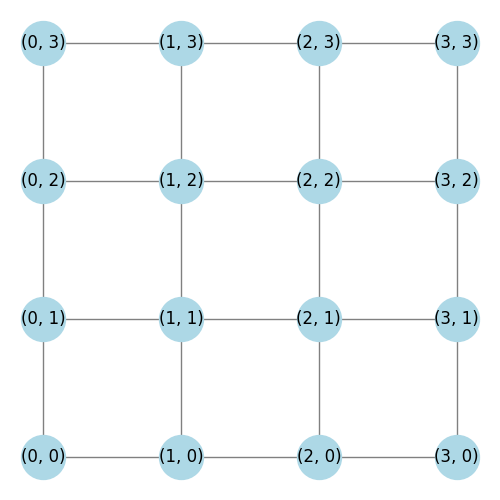
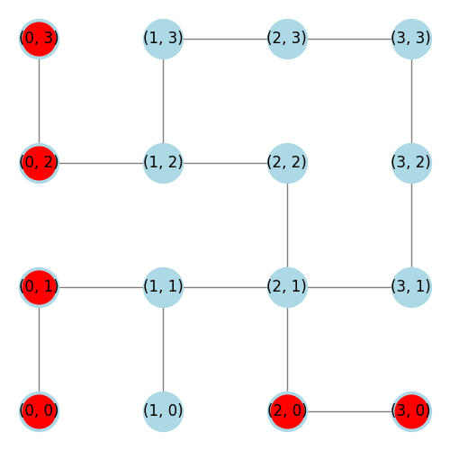
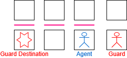
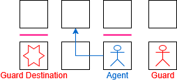
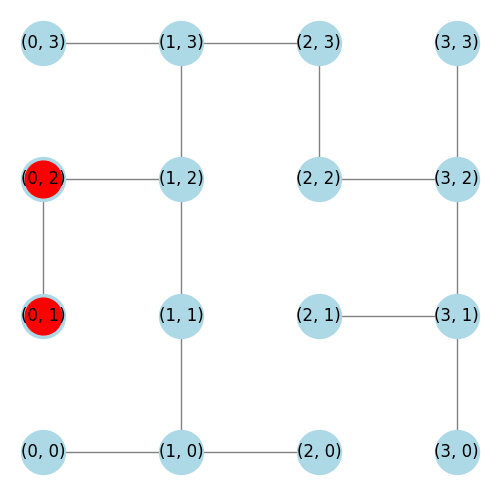
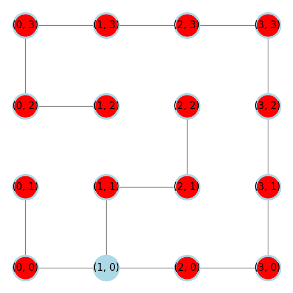
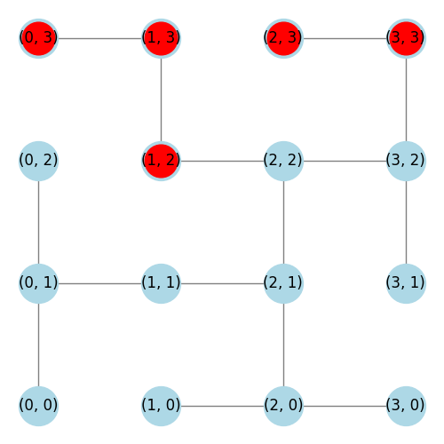
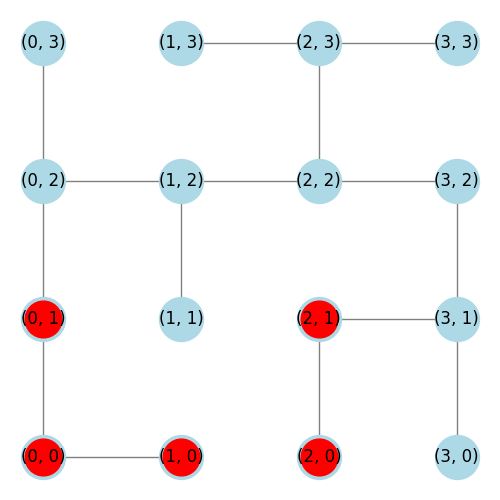
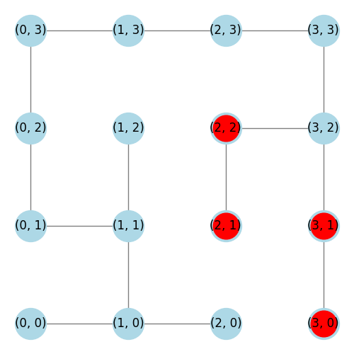

## About

The planned progression of this project is split into phases, starting with a simplified version of the environment in order to develop a simple Q-learning agent and obtain a benchmark result, then iteratively adding more complexity/features.

## Methodology

### Representing grids as graphs
An efficient method of representing the grid on each floor is by using graphs, wherein every tile is a node and the connections between the tiles (adjacent, not blocked by a wall) are edges. By using graphs, we can apply graph theory formulas/equations/algorithms (implemented with [networkx](https://networkx.org/)) to simplify certain procedures that would be more difficult in a 2D cartesian coordinate system. 

**Example 1:** we can use `nx.shortest_path` (an implementation of [Dijkstra's Algorithm](https://en.wikipedia.org/wiki/Dijkstra%27s_algorithm)) to determine the path a guard will take to reach its destination.

**Example 2:** we can use `nx.is_connected` in our method to randomize the wall layout to ensure that with each added wall every tile on the graph remains reachable.

## Phase 1 -- Simplified Rules & No Walls

*[Average Connectivity](#average-connectivity): 100%*

In an environment where:
- There are no walls or traps/alarms
- There are no tools or loot
- There is only a single floor with a single safe
- There is only a single agent
- The agent always starts at (0,0) and the guard starts at (3,3)
- The guard moves 2 tiles per turn
- The agent only loses stealth by moving into a guard or having a guard end its turn on the same tile
- The safe location is randomized (though unknown until the player moves onto the tile containing the safe)
- The only available actions are to move or attempt to crack a safe
- The agent gets 4 actions on every turn

it is not only possible for the win rate to be nearly 100%, but its actually quite likely to be 100% if it were an adult human playing)

In this simple environment, the game is quite trivial, most of the challenge of the game simply isn't present. This simplified environment is perfect for obtaining a benchmark.

It would be beneficial to see how well an agent can perform in such a simplified environment before adding more features. This test aims to prove that we are able to properly generate the environment, agent and Q-learning necessities, and train a agent that is capable of achieving its most fundamental task (learning how to exploit the environment through exploration).

When training agents, each "iteration" consists of setting up the game (randomizing safe location, etc), and having the game play all the way from the first turn until the game is over. Each game will end in a Win or a Loss, there is no Tie.

In this environment, the agent was **trained on 300,000 iterations** at a **fixed exploration rate ε=0.2**.
Then, the agent ran another 300,000 iterations without exploring, ε=0. The results from these iterations were collected to form the benchmark.

Given the simplicity of this simple environment, **we are aiming to achieve a win rate near 100%**.

The benchmark win rate achieved was 93%:

> WIN RATE: 93% --- TOTAL WINS: 278783, TOTAL LOSSES: 21217

## Phase 2 -- Adding Walls at Fixed Locations

*[Average Connectivity](#average-connectivity): 66%*

*[Why are some of the nodes red?](#the-danger-of-hallways)*

In *The Bank Job* scenario of *Burgle Bros.*, each floor has 8 walls.
The location of each wall is fixed, i.e, it is pre-defined in the rules.

Agents and Guards are not able to move through walls.
If an agent attempts to move through a wall, it is punished, and forced to chose a different action.

In phase 2, we build on the environment of phase 1 by introducing the fixed wall layout from Floor 1 of *The Bank Job* scenario.

A new agent was trained in this new environment, using the same training technique as in Phase 1. The results are as follows:

> WIN RATE: 89% --- TOTAL WINS: 265982, TOTAL LOSSES: 34018

This is a slightly worse performance than our benchmark, however, considering the added difficulty for the agent to have to learn how to maneouvre around walls, it performed well!

## Phase 3 -- Adding Walls at Randomized Locations

## Average Connectivity

Average Connectivity is a measure of how well-connected the tiles (i.e, nodes) in the grid are, taking into account the presence of walls.

Every tile in the grid has neighbouring tiles.

| Tile Location | Neighbour Count (Degree) |
| ------------- | --------------- |
| Corner | 2 |
| Edge | 3 |
| Interior | 4 |

In a grid without walls, each tile would be connected to each of its neighboring tiles, therefore each tile would have a connectivity of 100%. However, when walls are placed, certain connections between tiles and their neighbours become severed, lowering the connectivity of the tile to the overall network. Tiles with lower connectivity are more isolated and harder to reach.

The average connectivity is calculated by comparing the number of neighbors each node (tile) is connected to against its theoretical maximum number of neighbor connections (i.e., its unwalled grid). The value is normalized, with each node's connectivity represented as a fraction of its maximum possible degree.

### Why It’s Important:

Normalized Connectivity reflects the extent to which the grid is still navigable. A high average connectivity indicates that most of the grid is still connected and traversable, while a low value means that walls have significantly fragmented the grid.
This metric is useful for evaluating the effects of adding walls: it helps you understand whether walls are causing the grid to become too disconnected, making it harder for the agent to navigate.

### The Danger of Hallways

> **To illustrate the presence of a hallway, nodes that are part of a hallway have a red center.**

In my experience playing *Burgle Bros.*, I found that one of the most dangerous places to find yourself in was in a hallway. It is not difficult to understand why this is the case. Take for example the following situation:

Assuming the agent has only move actions available, the 3 walls are preventing the agent from any chance of moving out of the path of the guard. The agent must then chose to either walk through the guard and lose stealth, or wait for the guard to move through them.

If instead we removed a wall to break-up the hallway as follows:

now the agent has an available escape path!

When analysing the wall layout on any given floor, it's quite intuitively understood that layouts with more/longer hallways can lead to more dangerous game-threatening situations. To quantify what exactly a hallway is, the following definition is used:

> A hallway occurs whenever a degree-1 is connected to a chain of one or more degree-2 nodes that eventually connects to a node with a degree greater than 2.

#### Hallways v.s Average Connectivity

Consider the following two wall layouts. Which one appears more difficult to navigate safely?

| Layout 1 -- Average Connectivity of 62% | Layout 2 -- Average Connectivity of 68%  |
|----------|----------|
|  |  |

The example above demonstrates how even though the second layout has a higher average connectivity, that doesn't *necessarily* mean that is less dangerous of a layout

It's not only about about how connected the network is, it's about *where* that connectivity is occuring. In the previous example, the hallway from (2,0) to (1,2) contains 10 nodes. The average connectivity of just those 10 nodes is 72%. But that value is deceiving! It's high because the corner nodes are fully connected, and the edge nodes have 2 of 3 connections each.

### Average and Longest Path Lengths

Consider the following wall layouts. Each layout is 16 tiles, with 8 walls. Before seeing the layouts, guess which layout is more dangerous.

| |Average Connectivity | Average Path Length | Longest Path | Nodes in Hallways |
|-| ------------------- | ------------------- | ------------ | ----------------- |
| Layout 1 | 62% | 3 | 7 | 5
| Layout 2 | 63% | 4 | 9 | 5
| Layout 3 | 65% | 5 | 11 | 4

Here are the actual layouts:

| Layout 1 | Layout 2 | Layout 3 |
| -------- | -------- | -------- |
|  |  | 

Layout 3 is an interesting one, as many of the nodes are clearly in a hallway, but they do not fit our current definition of a hallway...