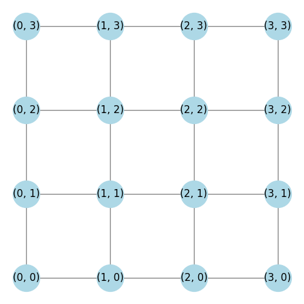
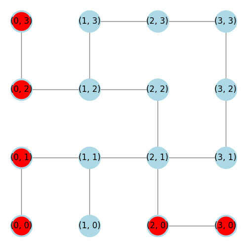

## About

The planned progression of this project is split into phases, starting with a simplified version of the environment in order to develop a simple Q-learning agent and obtain a benchmark result, then iteratively adding more complexity/features.

## Phase 1 -- Simplified Rules, No Walls
In an environment where:
- There are no walls or traps/alarms
- There is only a single floor
- There is only a single agent
- The agent always starts at (0,0) and the guard starts at (3,3)
- The guard moves 2 tiles per turn
- The agent only loses stealth by moving into a guard or having a guard end its turn on the same tile
- The safe location is randomized (though unknown until the player moves onto the tile containing the safe)
- The only available actions are to move or attempt to crack a safe
- The agent gets 4 actions on every turn

Reachability 100%

it is not only possible for the win rate to be nearly 100%, but its actually quite likely to be 100% if it were an adult human playing)

In this simple environment, the game is quite trivial, most of the challenge of the game simply isn't present. This simplified environment is perfect for obtaining a benchmark.

It would be beneficial to see how well an agent can perform in such a simplified environment before adding more features. This test aims to prove that we are able to properly generate the environment, agent and Q-learning necessities, and train a agent that is capable of achieving its most fundamental task (learning how to exploit the environment through exploration).

When training agents, each "iteration" consists of setting up the game (randomizing safe location, etc), and having the game play all the way from the first turn until the game is over. Each game will end in a Win or a Loss, there is no Tie.

In this environment, the agent was **trained on 300,000 iterations** at a **fixed exploration rate ε=0.2**.
Then, the agent ran another 300,000 iterations without exploring, ε=0. The results from these iterations were collected to form the benchmark.

Given the simplicity of this simple environment, **we are aiming to achieve a win rate near 100%**.

The benchmark win rate achieved was 93%.

> TOTAL WINS: 278783, TOTAL LOSSES: 21217, WIN RATE: 93%

## Adding Walls

By adding in a fixed wall layout (from floor 1 of the scenario "The Bank Job"), and re-training, the agent achieved a win rate of 89%.
(TOTAL WINS: 265982 TOTAL LOSSES: 34018)

Reachability 66%

